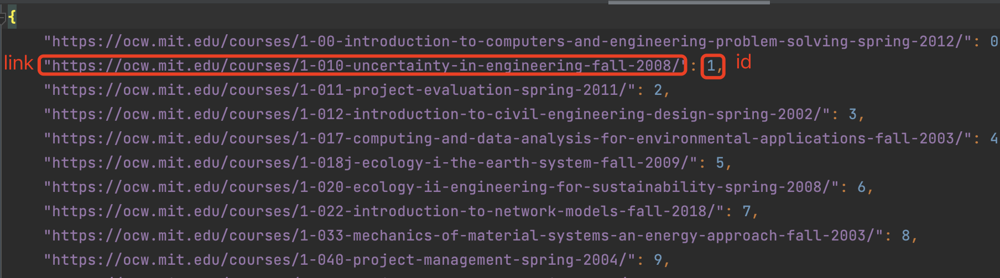
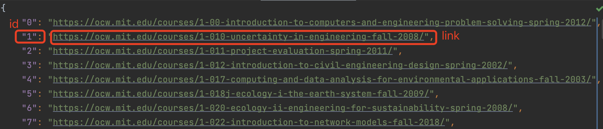
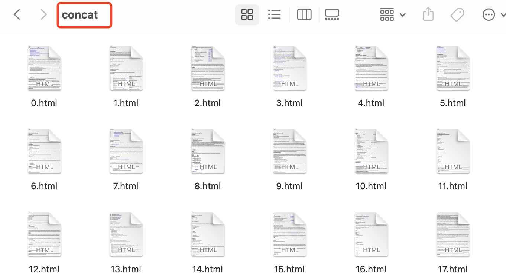
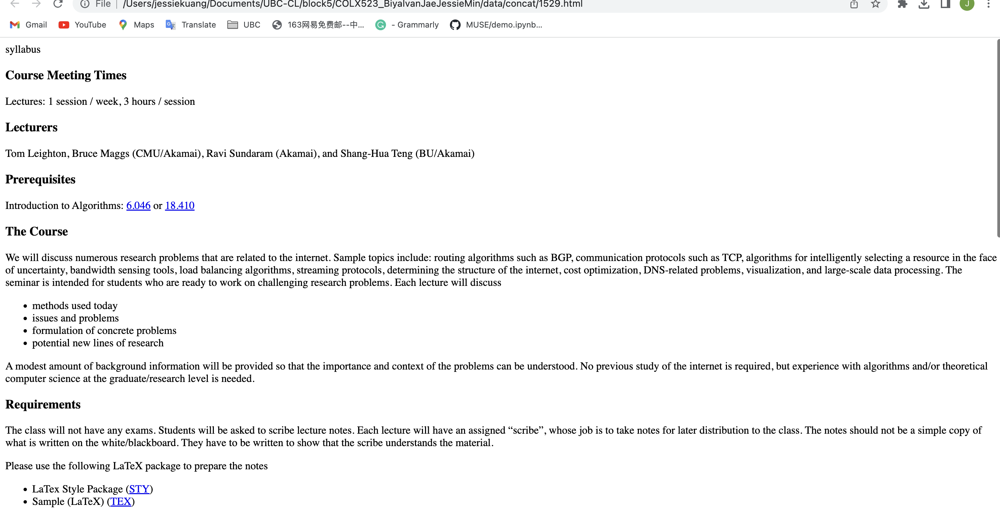
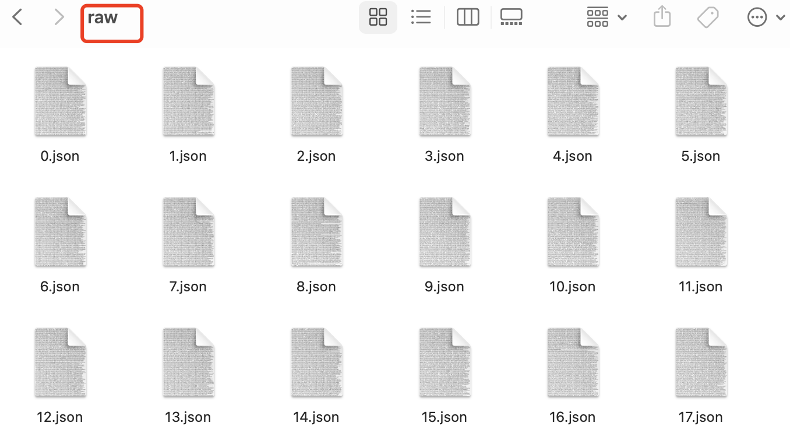
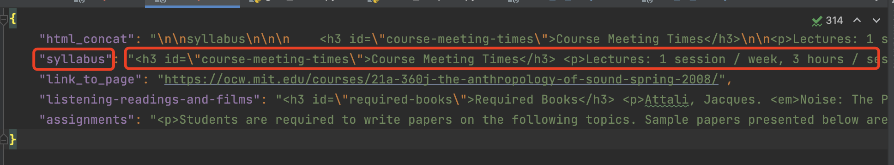
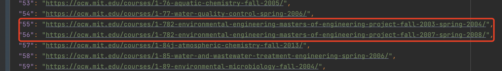

# corpus_readme.md

## Package Requirement
- Python (>=3.7)
- selenium (>=4.0)
- webdriver-manager

## Getting Started
### Set Up
```
pip install selenium==4.0.0.a7
pip install webdriver-manager
```
### Repo Structure
```
.
├── data
│   ├── raw     
│   └── concat
├── milestone_2
│   ├── indexer.py     
│   └── raw_text_scraper.py
```
### Usage
```
python indexer.py
python raw_text_scraper.py
```
## Corpus

- source of the corpus: https://ocw.mit.edu/courses/
- collected corpus: https://github.ubc.ca/MDS-CL-2022-23/COLX523_BiyaIvanJaeJessieMin/tree/milestone2/milestone_2/data/concat (change it when merge)
- total number of documents: 2494
- total amount of text: ???

### Storage
- **link_to_index.json** (created by indexer.py)
  - a JSON file that contains a dictionary. The key is the link to the course, and value is the index id that we assign
  - link: https://github.ubc.ca/MDS-CL-2022-23/COLX523_BiyaIvanJaeJessieMin/tree/milestone2/milestone_2/data (**change it when merge**)
  - example
  

- **index_to_link.json** (created by indexer.py)
  - a JSON file that contain a dictionary. the key is the index id of the course, and the value is link to the course
  - link: https://github.ubc.ca/MDS-CL-2022-23/COLX523_BiyaIvanJaeJessieMin/tree/milestone2/milestone_2/data (**change it when merge**)
  - example
  
  

- **concat/** (create by raw_text_scraper.py)
  - a folder of HTML files, and each of them contains concatenated sub-pages of the course. Each file is named by the course id (e.g. 0.html)
  - link: https://github.ubc.ca/MDS-CL-2022-23/COLX523_BiyaIvanJaeJessieMin/tree/milestone2/milestone_2/data (**change it when merge**)
  - concat folder <br />
  <br />
  - html file example <br />
  <br />


- **raw/** (create by raw_text_scraper.py)
  - a folder of JSON files, and each is a dict of the source code of sub-pages. The key is the sub-page tile, and the value is its source code.
  - link: https://github.ubc.ca/MDS-CL-2022-23/COLX523_BiyaIvanJaeJessieMin/tree/milestone2/milestone_2/data (**change it when merge**)
  - raw folder <br />
   <br />
  - json file example
  


## Problems With the Corpus
- duplicate course
    - some courses are the same but for different years so books may be similar in these courses.
    
 

