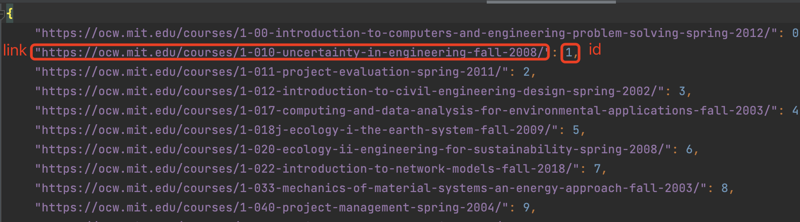
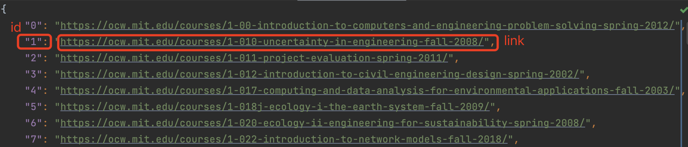
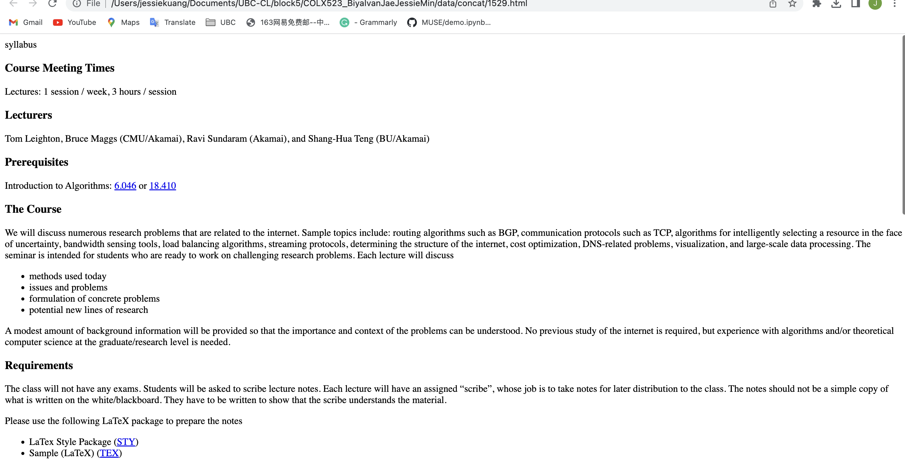
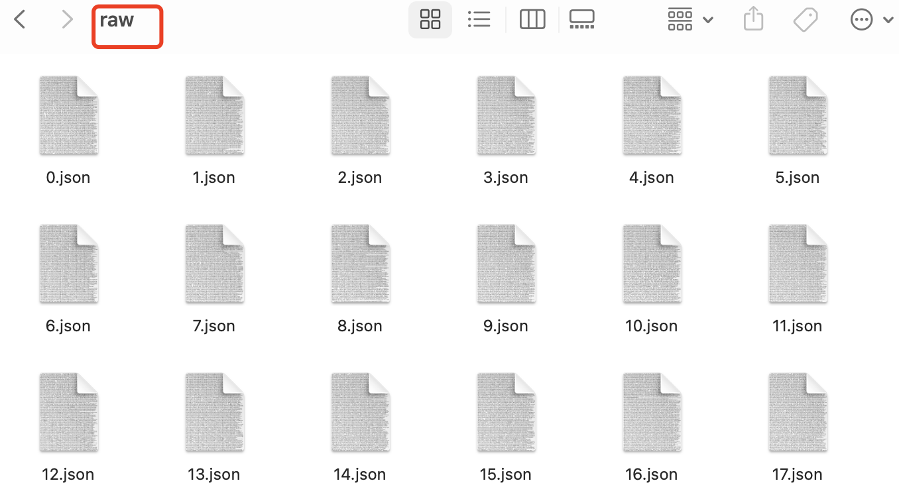
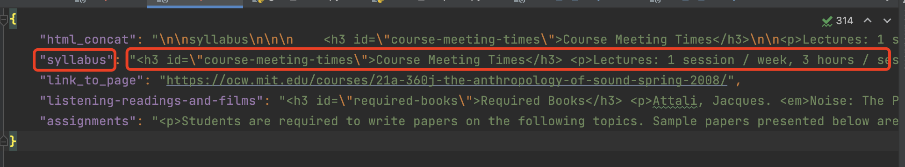
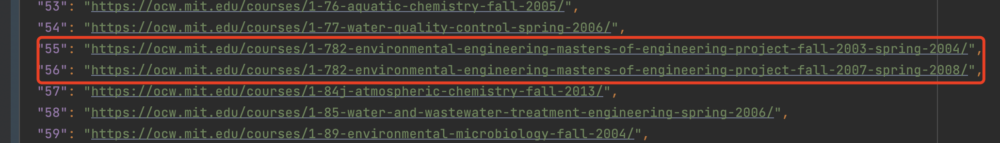

# corpus_readme.md

## Package Requirement
- Python (>=3.7)
- selenium (>=4.0)
- webdriver-manager

## Getting Started
### Set Up
```
pip install selenium==4.0.0.a7
pip install webdriver-manager
```

### Repo Structure

A roadmap to help you find all the milestone_2 related files:

```
.
├── data
│   ├── index_to_link.json           # FROZEN DATA - created by indexer.py     
│   ├── link_to_index.json           # FROZEN DATA - created by indexer.py 
│   ├── raw.zip                      # FROZEN DATA - created by raw_text_scraper.py
│   ├── concat.zip                   # FROZEN DATA - created by raw_text_scraper.py
│   └── mit_ocw_courses.json.zip     # FROZEN DATA - created by raw_text_scraper.py
├── milestone_2
│   ├── indexer.py                   # corpus collection code 1
│   ├── raw_text_scraper.py          # corpus collection code 2
│   ├── corpus_collection.md         # explanation on corpus collection
│   ├── corpus_readme.md             # corpus + explanation
│   ├── screeshot/                   # screenshots for corpus_readme.md
│   ├── corpus_analysis.md           # reasoning answers on corpus analysis (optional)
│   ├── corpus_analysis.ipynb        # code accompanying corpus analysis
│   ├── annotation_plan.pdf          # annotation plan
│   ├── annotator.zip                # custom HTML annotator
│   ├── annotation_materials.pdf     # annotation materials
│   └── annotator sample/            # contains sample annotations for annotation_materials.pdf


```
### Usage
```
python indexer.py
python raw_text_scraper.py
```
## Corpus

- source of the corpus: https://ocw.mit.edu/courses/
- collected corpus: https://github.ubc.ca/MDS-CL-2022-23/COLX523_BiyaIvanJaeJessieMin/tree/milestone2/data/concat.zip
- total number of documents: 2494
- total amount of text: 7858138
```{python}
from bs4 import BeautifulSoup
from nltk.tokenize import word_tokenize
from os.path import isfile, join

html_path = "./data/concat"
existing_files = [f for f in listdir(html_path) if isfile(join(html_path, f)) and f.endswith('.html')]
total_words = 0
for f in existing_files:
    with open(join(html_path, f)) as fp:
        soup = BeautifulSoup(fp, 'html.parser')
    texts = soup.findAll(text=True)
    temp = [t.strip() for t in texts]
    # print(word_tokenize("".join(temp)))
    total_words += len(word_tokenize("".join(temp)))
print("total amount of text in words is", total_words)

# total amount of text in words is 7858138
```

### Storage
- **link_to_index.json** (created by indexer.py)
  - a JSON file that contains a dictionary. The key is the link to the course, and value is the index id that we assign
  - link: https://github.ubc.ca/MDS-CL-2022-23/COLX523_BiyaIvanJaeJessieMin/blob/milestone2/data/link_to_index.json
  - example
  

- **index_to_link.json** (created by indexer.py)
  - a JSON file that contain a dictionary. the key is the index id of the course, and the value is link to the course
  - link: https://github.ubc.ca/MDS-CL-2022-23/COLX523_BiyaIvanJaeJessieMin/blob/milestone2/data/index_to_link.json
  - example
  
  

- **concat/** (create by raw_text_scraper.py)
  - a folder of HTML files, and each of them contains concatenated sub-pages of the course. Each file is named by the course id (e.g. 0.html)
  - link: https://github.ubc.ca/MDS-CL-2022-23/COLX523_BiyaIvanJaeJessieMin/tree/milestone2/data/concat.zip OR https://github.ubc.ca/MDS-CL-2022-23/COLX523_BiyaIvanJaeJessieMin/tree/milestone2/data/mit_ocw_courses.json.zip
  - concat folder <br />
  <br />
  - html file example <br />
  <br />


- **raw/** (create by raw_text_scraper.py)
  - a folder of JSON files, and each is a dict of the source code of sub-pages. The key is the sub-page tile, and the value is its source code.
  - link: https://github.ubc.ca/MDS-CL-2022-23/COLX523_BiyaIvanJaeJessieMin/tree/milestone2/data/raw.zip
  - raw folder <br />
   <br />
  - json file example
  


## Problems With the Corpus
- duplicate course
    - some courses are the same but for different years so books may be similar in these courses.
    
 

